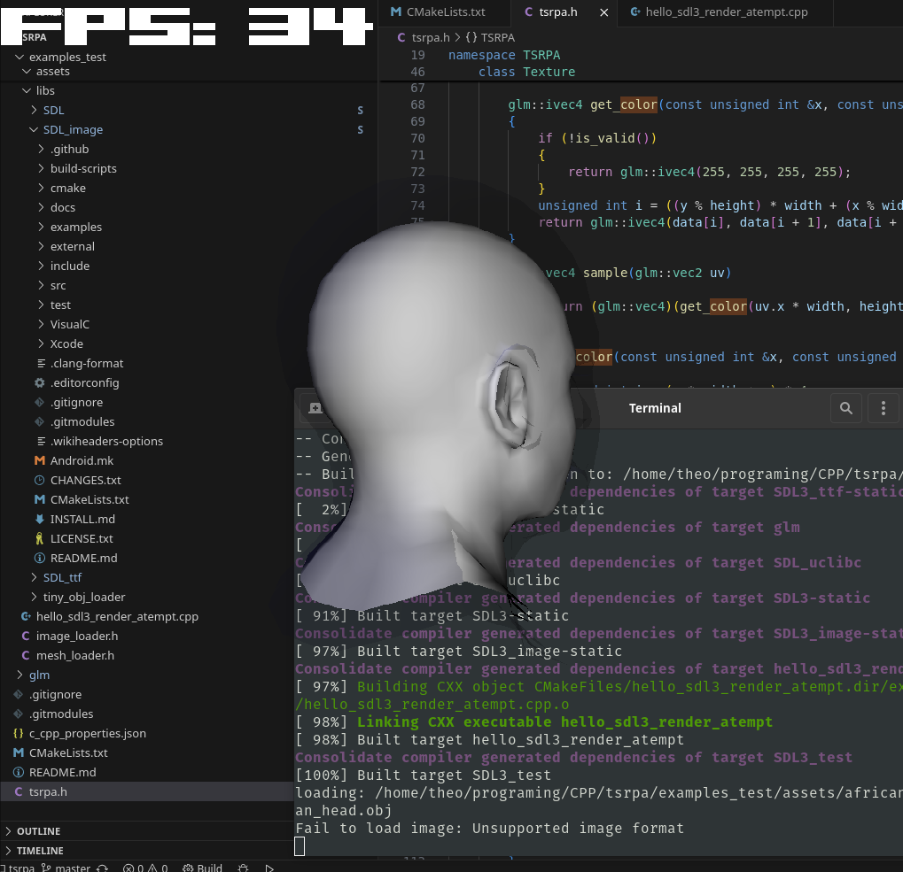
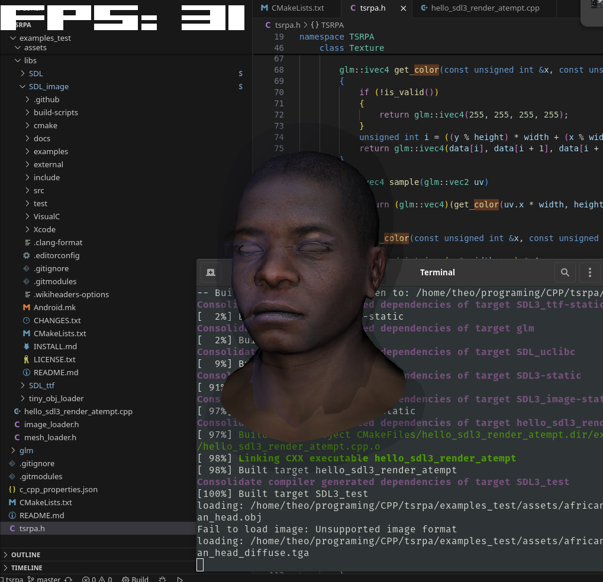
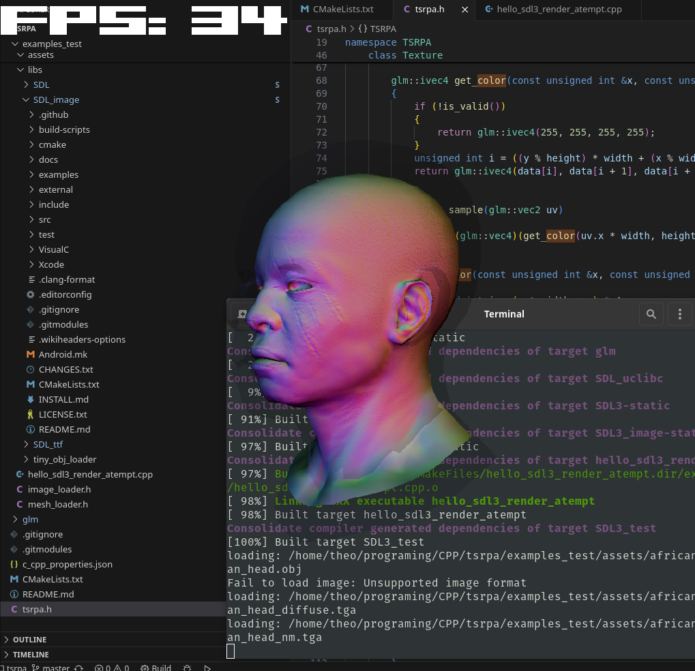

tsrpa stands for: Théo software renderer patetic atempt

a patetic atempt to create a single header software renderer





my compile comand
```bash```
    mkdir build
    cd build
    cmake .. ; make ; ./hello_sdl3_render_atempt